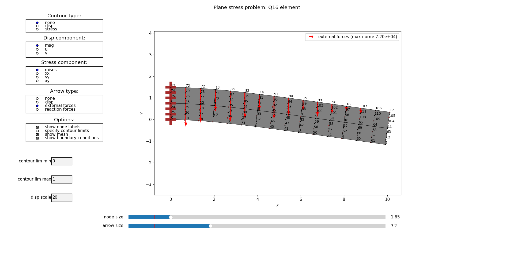
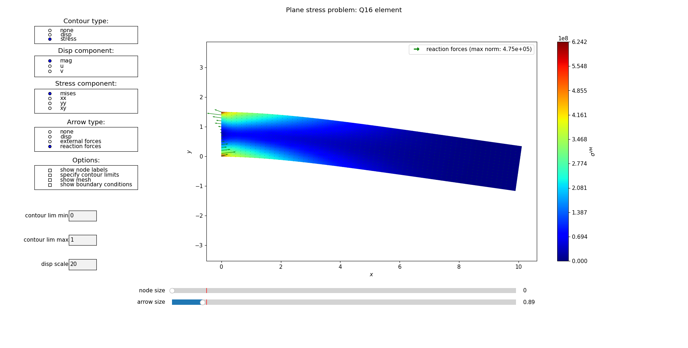
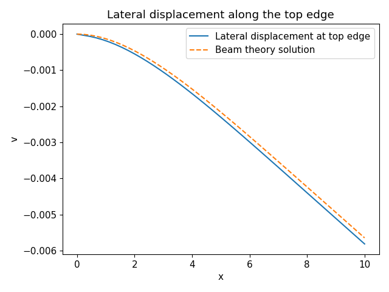

# Educational 2D FEM tool for static linear analysis written in Python

---

## Current features:
- 2D structured mesh generator for Q4, Q8, Q9, and Q12 quadrilateral elements
- Plane stress elements and plate elements (Mindlin)
- Consistent load integration either on faces or edges, where the load is specified as a function of x, y
- Zero or prescribed displacement boundary conditions
- Simple GUI (see images below)

  
*The current problem has a linearly varying pressure load p(x) = (L_x - x)p_0 applied to the top edge.  
The arrows shown are the external nodal forces arising from consistent load integration of this pressure.  
The brown features on the left edge mark the fixed boundary condition.*

  
*Von Mises stress (no nodal averaging) computed for each element. Reaction forces that counteract the external forces are also displayed.  
Note that this mesh is finer than the mesh shown above.*

---

The following script was used to specify the displayed problem:

```python
from src.useful_imports import *  #import required functions

if __name__ == "__main__":

    E = 210e9  # Young's modulus in Pa
    nu = 0.3  # Poisson's ratio
    h = 0.01  # Plate thickness in m
    Lx = 10.0  #Length in x-direction
    Ly = 1.5  #Length in y-direction
    p0 = 1000000  #Pressure applied to the top edge
    element_type = ELEMENT_TYPE_Q16  #Use 16 node quadrilateral element
    problem_type = PROBLEM_TYPE_PLANE_STRESS  #Specify that a plane stress problem is solved
    nEx = 15  #Number of elements in x-direction
    nEy = 2  #Number of elements in y-direction

    #====================================================================
    # Group problem settings in an object called config
    #====================================================================
    config = create_config(E, nu, h, element_type, problem_type)

    #====================================================================
    # Create a rectangular structured mesh
    #====================================================================
    mesh = create_structured_quad_mesh(config, Lx=Lx, Ly=Ly, nEx=nEx, nEy=nEy)

    #====================================================================
    # Add fixed boundary condition  to the left edge called "west"
    #====================================================================
    add_boundary_condition(config, mesh, "west", DOF_U, 0)  #set u to 0
    add_boundary_condition(config, mesh, "west", DOF_V, 0)  #set v to 0

    #====================================================================
    # Assign a linearly varying load on the top edge named "north"
    #====================================================================
    load_func = lambda x, y: p0 * (1 - x / Lx)
    add_load(config, mesh, "north", LOAD_TYPE_PRESSURE, load_func)

    #====================================================================
    # Create objects holding system matrices and vectors. Then assemble
    # the stiffness matrix, integrate loads and assign boundary conditions
    # before finally solving the system K*r = R_ext
    #====================================================================
    solver_data = create_solver_data(config, mesh)
    solve(config, solver_data, mesh)

    #====================================================================
    # Before starting the GUI, we show how we can do some post-processing of the results
    # Here, we take out the lateral displacement along the top edge and
    # compare it to an analytical beam solution. The beam solution when
    # the load is given as q(x) = -(p0*h) * (1 - x / Lx) is given as:
    # v(x) = -(p0*h) / (E*I) * (x^4 / 24 - x^5 / (120*Lx) - Lx / 12 * x^3 + Lx^2 / 12 * x^2)
    #====================================================================
    #Fetch the individual displacement components from the generalized displacement vector r 
    u, v = unpack_solution(config, solver_data.r) 
    nodeIDs_top = mesh.node_sets["north"] #The node indices of the node set "north"
    x_top = mesh.nodes[nodeIDs_top, 0] #Get the x-coordinates along the top edge
    # Sort the nodes along the top edge according to their x-coordinate
    # since the nodes in the mesh are not necessarily ordered in the x-direction.
    nodeIDs_top_ordered = nodeIDs_top[np.argsort(x_top)]
    x_top_ordered = mesh.nodes[nodeIDs_top_ordered, 0] #Take out the x coordinates along the top so that they are ordered
    v_top_ordered = v[nodeIDs_top_ordered] #Take out the lateral displacements v_top_ordered the same way as x_top_ordered 
    I = Ly**3 * h / 12  #Moment of inertia for a rectangular cross-section
    v_theory = -(p0 * h) / (E * I) * (x_top_ordered**4 / 24 - x_top_ordered**5 /
                                      (120 * Lx) - Lx / 12 * x_top_ordered**3 + Lx**2 / 12 * x_top_ordered**2)

    plt.plot(x_top_ordered, v_top_ordered, label="Lateral displacement at top edge")
    plt.plot(x_top_ordered, v_theory, label="Beam theory solution", linestyle='--')
    plt.xlabel("x")
    plt.ylabel("v")
    plt.legend()
    plt.title("Lateral displacement along the top edge")
    plt.tight_layout()

    #====================================================================
    # Start the GUI to visualize the results
    #====================================================================
    Plot(config, mesh, solver_data)
```

  
*Comparison against beam theory for the current case. The reason that the curves don't match better is that the length to thickness ratio of the beam (Lx/Ly=10/1.5 = 6.67 < 10) is too low.
If we lower Ly from 1.5 to 0.5, the relative tip error is reduced from 2.98% to 0.14%.*


## Usage

Make sure you have Python 3.8+ with **numpy**, **matplotlib**, and **scipy** installed.

To test the program, clone the project, navigate to the project root directory and run:

```bash
python main.py
```

No installation is currently supported.
